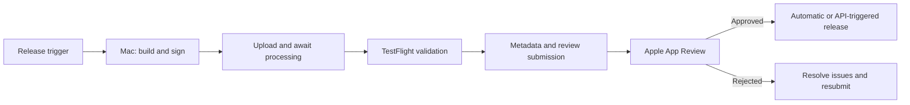

# iOS App Store Release Automation

Researched: 2026-09-06. Scope: publishing RouteVN Creator's iOS app and subsequent
updates through Apple's App Store. This is a feasibility report and proposed
workflow; an authenticated upload or release was not tested.

## Finding

Yes. Apple provides official automation for binary uploads, TestFlight,
App Store metadata, review submission, and release of approved versions through
the App Store Connect API and command-line tools. A release can run from CI
without clicking through App Store Connect on every update. Apple's
[API overview](https://developer.apple.com/documentation/appstoreconnectapi)
describes the supported areas.

Direct binary upload through the REST API is now supported. Apple introduced
the Build Upload API at WWDC25, so older guidance saying that REST cannot upload
an app binary is outdated. See Apple's
[build upload announcement and walkthrough](https://developer.apple.com/videos/play/wwdc2025/324/)
and current
[upload documentation](https://developer.apple.com/help/app-store-connect/manage-builds/upload-builds/).

Uploading, submitting for review, and releasing are separate operations.
Automation can perform the developer's steps, but Apple still reviews the app.
The release can then happen automatically after approval, after approval and a
specified earliest date, or through a later release request. See
[submitting an app](https://developer.apple.com/help/app-store-connect/manage-submissions-to-app-review/submit-an-app)
and [release options](https://developer.apple.com/help/app-store-connect/manage-your-apps-availability/select-an-app-store-version-release-option).

## What Can Be Automated

| Step                            | Supported mechanism                                        | Important boundary                                                                                 |
| ------------------------------- | ---------------------------------------------------------- | -------------------------------------------------------------------------------------------------- |
| Build and sign the iOS app      | Xcode command-line workflow or Xcode Cloud                 | The REST API does not compile source code. Produce a device distribution build with valid signing. |
| Upload the binary               | Build Upload REST API, Transporter, Xcode, or `altool`     | Upload completion must be followed by successful Apple processing.                                 |
| Distribute to TestFlight        | API for builds, beta groups, testers, and beta review      | External testing has a separate Beta App Review workflow.                                          |
| Create an updated store version | App Store Versions API                                     | The version belongs to an existing app record.                                                     |
| Update store content            | Metadata/localization APIs and asset upload APIs           | Required content and editable fields depend on the app/version state.                              |
| Submit for App Review           | Review Submissions and Review Submission Items APIs        | Required metadata and a selected build must be ready first.                                        |
| Publish after approval          | Automatic release settings or Version Release Requests API | A release request cannot approve an app or bypass review.                                          |
| Roll out an update gradually    | App Store Version Phased Releases API                      | Phased rollout concerns automatic updates; people can still download the update manually.          |
| Monitor progress                | Read status resources; use supported webhook events        | Treat processing, review, and public availability as different states.                             |

Apple documents
[build distribution](https://developer.apple.com/documentation/xcode/distributing-your-app-for-beta-testing-and-releases),
[TestFlight build management](https://developer.apple.com/documentation/appstoreconnectapi/builds),
[version creation](https://developer.apple.com/documentation/appstoreconnectapi/post-v1-appstoreversions),
[metadata and asset automation](https://developer.apple.com/documentation/appstoreconnectapi),
[review submissions](https://developer.apple.com/documentation/appstoreconnectapi/review-submissions),
and [approved-version release requests](https://developer.apple.com/documentation/appstoreconnectapi/app-store-version-release-requests).
Its [phased release guide](https://developer.apple.com/help/app-store-connect/update-your-app/release-a-version-update-in-phases)
explains rollout behavior.

## Automation Options

| Option                                           | What it supplies                                                                                                                     | Fit for this repository                                                                                                    |
| ------------------------------------------------ | ------------------------------------------------------------------------------------------------------------------------------------ | -------------------------------------------------------------------------------------------------------------------------- |
| `xcodebuild` + Transporter + REST API            | Apple tools handle build/signing and binary delivery; scripts manage metadata, TestFlight, review, and release.                      | Recommended starting point. Fits the existing command-line approach without a release framework dependency.                |
| `xcodebuild` + direct REST upload and publishing | One HTTP integration for upload and store management. Uploads use reservations, potentially multiple file chunks, and a commit step. | Useful if we want Bun/JavaScript to own the complete publishing integration. Requires more upload orchestration.           |
| Xcode Cloud + REST API                           | Apple-hosted CI with build/test/archive actions and distribution post-actions. API can manage workflows and start builds.            | Useful if we want Apple to host the build machines. Requires initial Xcode onboarding and custom setup for Bun/web assets. |
| Fastlane                                         | Third-party automation: `pilot` / `upload_to_testflight` and `deliver` / `upload_to_app_store`.                                      | Optional if metadata/localization and release scripting become large enough to justify another toolchain.                  |

Apple's [upload guide](https://developer.apple.com/help/app-store-connect/manage-builds/upload-builds/)
explicitly supports Transporter command-line uploads authenticated with API JWTs
and still lists `altool` for app uploads.

Xcode Cloud's documented post-actions distribute to TestFlight or upload a build
that can subsequently be submitted for App Review. Plan review submission and
production release as additional orchestration. Initial configuration uses
Xcode; subsequent workflow management can use App Store Connect or its API.
See the [Xcode Cloud workflow reference](https://developer.apple.com/documentation/xcode/xcode-cloud-workflow-reference).

Fastlane can [upload TestFlight builds](https://docs.fastlane.tools/actions/upload_to_testflight/)
and [upload store assets/binaries, submit for review, and configure automatic release](https://docs.fastlane.tools/actions/upload_to_app_store/).
Its [API authentication support matrix](https://docs.fastlane.tools/app-store-connect-api/)
confirms API-key support for `pilot` and `deliver`, but not every Fastlane action.
Fastlane is a convenience layer, not an Apple requirement.

## Direct REST Workflow

This is an endpoint map, not a complete executable implementation. Resolve IDs
from API responses and use Apple's current request schemas.

### Upload a Build

1. Produce the signed distribution `.ipa` using Xcode tooling. A simulator
   `.app` is not the release artifact.
2. Create the build upload record with `POST /v1/buildUploads`, identifying the
   app and build version/platform. See
   [Create a Build Upload](https://developer.apple.com/documentation/appstoreconnectapi/post-v1-builduploads).
3. Reserve its binary file with `POST /v1/buildUploadFiles`, supplying the file
   details and build-upload relationship. See
   [Create a Reservation for a Build Upload File](https://developer.apple.com/documentation/appstoreconnectapi/post-v1-builduploadfiles).
4. Execute the returned upload operations using their URLs, headers, and byte
   ranges. Large files may require multiple `PUT` requests. See Apple's
   [Build Upload API walkthrough](https://developer.apple.com/videos/play/wwdc2025/324/).
5. Commit with `PATCH /v1/buildUploadFiles/{id}` and `uploaded: true`. See
   [Commit a Build Upload File](https://developer.apple.com/documentation/appstoreconnectapi/patch-v1-builduploadfiles-_id_).
6. Wait for successful build processing, then resolve the processed `builds`
   resource. A successful file transfer alone does not make the build ready for
   release. See [Build uploads](https://developer.apple.com/documentation/appstoreconnectapi/build-uploads)
   and [build processing statuses](https://developer.apple.com/help/app-store-connect/manage-builds/view-builds-and-metadata).

The upload/status integration can run on any platform with HTTP support; building
and signing this native iOS project remains a macOS/Xcode job. That separation
allows a Mac build runner and a separate publishing service if useful.

### Prepare, Submit, and Release an Update

1. Create the next store version through `POST /v1/appStoreVersions`, or reuse
   the appropriate existing draft. Update its localized metadata, screenshots,
   review information, release settings, and selected processed build. See
   [App Store Versions](https://developer.apple.com/documentation/appstoreconnectapi/app-store-versions)
   and [asset uploads](https://developer.apple.com/documentation/appstoreconnectapi/uploading-assets-to-app-store-connect).
2. Create a review submission with `POST /v1/reviewSubmissions`. See
   [Create a Review Submission](https://developer.apple.com/documentation/appstoreconnectapi/post-v1-reviewsubmissions).
3. Add the version using `POST /v1/reviewSubmissionItems`, linking the submission
   and `appStoreVersion`. See
   [Review submission items](https://developer.apple.com/documentation/appstoreconnectapi/review-submission-items).
4. Submit it with `PATCH /v1/reviewSubmissions/{id}`, setting `submitted: true`.
   See [Modify a Review Submission](https://developer.apple.com/documentation/appstoreconnectapi/patch-v1-reviewsubmissions-_id_)
   and the [update attributes](https://developer.apple.com/documentation/appstoreconnectapi/reviewsubmissionupdaterequest/data-data.dictionary/attributes-data.dictionary).
5. Track review status and address any rejection. On approval, automatic release
   settings can publish the version. If configured for manual release, use
   `POST /v1/appStoreVersionReleaseRequests` when the version is in Pending
   Developer Release. See
   [Version Release Requests](https://developer.apple.com/documentation/appstoreconnectapi/app-store-version-release-requests).

Use the current review-submission resources for new integrations. Apple
deprecated `appStoreVersionSubmissions` and its related endpoints in the
[API 1.7 release notes](https://developer.apple.com/documentation/appstoreconnectapi/app-store-connect-api-1-7-release-notes).

## Account and Signing Setup

Before the first upload, establish Apple Developer Program membership, the
bundle ID, an App Store Connect app record, and distribution signing. Apple's
[distribution guide](https://developer.apple.com/documentation/xcode/distributing-your-app-for-beta-testing-and-releases)
describes the account/signing workflow. The Account Holder must accept the
current agreement before an app record can be added; see
[Add a new app](https://developer.apple.com/help/app-store-connect/create-an-app-record/add-a-new-app).

The Account Holder requests API access in Users and Access → Integrations.
An Account Holder or Admin can create a team key. See
[API access setup](https://developer.apple.com/help/app-store-connect/get-started/app-store-connect-api).

For a team key, the CI configuration needs its private `.p8` key, key ID, and
issuer ID. Sign short-lived JWTs; most API requests reject tokens with lifetimes
over 20 minutes. Renew tokens during long-running jobs. See
[Generating Tokens for API Requests](https://developer.apple.com/documentation/appstoreconnectapi/generating-tokens-for-api-requests).

Keep API authentication separate from application code signing: the publishing
key authorizes API operations; the app still needs a valid signing identity and
provisioning arrangement. Store private credentials in CI secrets, never in
the repository or packaged web assets. Apple allows the private API key to be
downloaded only once. Team keys cover all apps; individual keys inherit their
user's app access and roles but cannot use Provisioning endpoints. See
[Creating API Keys](https://developer.apple.com/documentation/appstoreconnectapi/creating-api-keys-for-app-store-connect-api).

A Developer role can upload builds, while app review submission requires
Account Holder, Admin, or App Manager. For upload plus publishing, App Manager is
the natural role to evaluate; check additional permissions separately if the
same integration also manages signing. See
[upload roles](https://developer.apple.com/help/app-store-connect/manage-builds/upload-builds/)
and [submission roles](https://developer.apple.com/help/app-store-connect/manage-submissions-to-app-review/submit-an-app).

## Limits of Automatic Updates

- **Review remains an external dependency.** A scheduled release date is an
  earliest release time after approval, not a promise of approval by that date.
  See [release options](https://developer.apple.com/help/app-store-connect/manage-your-apps-availability/select-an-app-store-version-release-option).
- **Store publication does not force installation.** Apple's phased release
  spreads automatic updates over seven days; anyone can manually download the
  update during that period. This is different from an in-app updater replacing
  the installed binary. See
  [phased release behavior](https://developer.apple.com/help/app-store-connect/update-your-app/release-a-version-update-in-phases).
- **Release inputs must be complete and accurate.** Automation submits metadata
  and a build; it does not decide the correct privacy disclosures, export
  compliance answers, or review access details. Prepare those inputs before
  enabling unattended submissions. See
  [submission prerequisites](https://developer.apple.com/help/app-store-connect/manage-submissions-to-app-review/submit-an-app).
- **Pipeline success needs state checks.** Persist upload/build/version/submission
  IDs and resume from them after failure. Handle processing errors, API rate
  limits, and review outcomes explicitly. Use bounded polling initially; add
  signed webhooks for supported events when useful. These are implementation
  recommendations based on Apple's
  [processing states](https://developer.apple.com/help/app-store-connect/manage-builds/view-builds-and-metadata)
  and [webhook walkthrough](https://developer.apple.com/videos/play/wwdc2025/324/).

## Proposed Path for This Repository

Current checked-in workflow:

- [iOS development docs](../ios.md) describe a native `WKWebView` shell and
  explicitly list production signing and App Store/TestFlight automation as
  not yet included.
- [scripts/ios.sh](../../scripts/ios.sh) builds Debug for `iphonesimulator` with
  `CODE_SIGNING_ALLOWED=NO`. It does not archive or export a distribution IPA.
- The [Xcode project](../../ios/routevn/routevn.xcodeproj/project.pbxproj) has
  automatic signing selected but an empty `DEVELOPMENT_TEAM`. The configured
  bundle ID is `com.routevn.creator`; registration in Apple's account was not
  verified.
- [build:ios](../../package.json) and
  [build-ios-assets.js](../../scripts/build-ios-assets.js) already prepare the
  packaged frontend. The existing
  [CI workflow](../../.github/workflows/ci.yaml) uses an Ubuntu runner for lint
  and web builds, so iOS archiving needs a separate Mac job.

Recommendation: preserve the simple-tools approach and add a macOS release job
using `xcodebuild`, Transporter for binary delivery, and App Store Connect REST
for TestFlight and store publishing. Consider direct REST upload if maintaining
the reservation/chunk/commit workflow in our own scripts is preferable.

Suggested implementation sequence:

1. Configure the developer team, distribution signing, app record, and CI API
   credentials. Verify a signed build on a physical device.
2. Add a release archive/export path alongside the simulator helper. Build the
   packaged web assets, use the Release configuration and an iOS device
   destination, then export for App Store Connect distribution.
3. Define explicit marketing-version and unique build-number inputs, and retain
   the archive, IPA, symbols, and originating commit for each release.
4. Automate upload, processing checks, and internal TestFlight distribution.
5. Add a release job that selects the tested build, updates store metadata,
   submits for review, and applies the chosen automatic or manual release mode.
6. Verify the resulting public version separately from upload/job success.

For routine updates, the intended flow is:

The immediate missing work is distribution signing and archive/export setup,
followed by release orchestration. Apple's automation support is sufficient;
Fastlane is optional.
